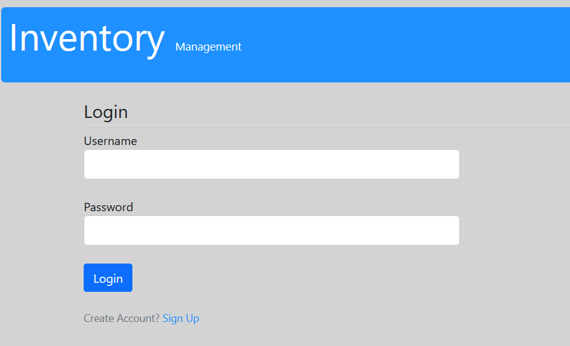

# INVENTORY MANAGEMENT WEB APPLICATION
   This repository contain Inventory Management Web Application Code With using [Flask](https://www.tutorialspoint.com/flask/index.htm) Framework.
# Overview
   This is a web application create by using Flask Framework.It helps to Maintain your inventory effectively & efficiently. Get reports on inventory inward and outward movements and make profitable decisions.
# Visuals
* Login Page

 
* SignUp Page 
 
* Home Page 
 
* ADD page 
 
* Make Movement Page 
 
* View Product Page 
 
* View Location Page 
 
* View Movement Page 
 
* View Report Page 
 
 
 
